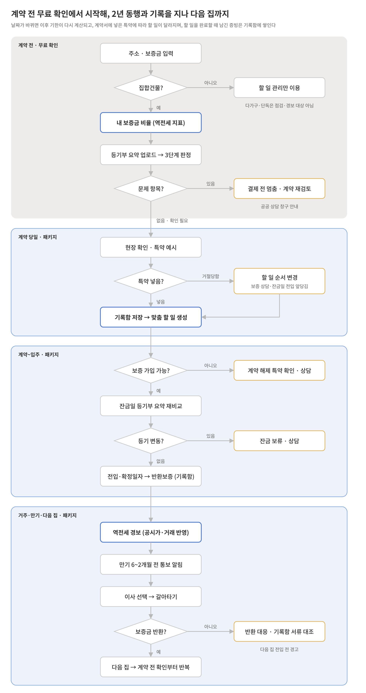
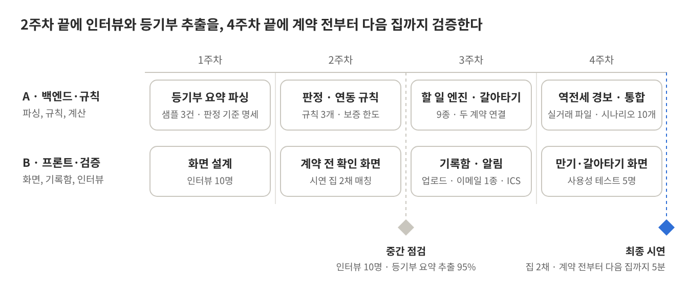

2026년 10월 7일 · v4.3

# 회사와 팀 구성

- **회사명:** \[회사명 입력\]

- **서비스명:** 전동기 (전세동행기록). 전세 계약 전부터 다음 집까지 동행하고, 그 과정을 기록해 보증금을 지킨다는 뜻

2인 팀이며, PM(프로젝트를 범위·일정 안에 완주)과 PO(제품 가치와 기능 우선순위)를 나눴습니다.

| **역할** | **이름** | **기획 담당**                                                  | **개발 담당 (4주 계획 기준)**                                                   |
|----------|----------|----------------------------------------------------------------|---------------------------------------------------------------------------------|
| PO       | \[이름\] | 기능 우선순위, 판정 기준·연동 규칙·할 일 9종 명세, 백로그 관리 | A · 백엔드·규칙: 등기부 요약 파싱, 판정·연동 규칙, 할 일 엔진, 역전세 경보 계산 |
| PM       | \[이름\] | 일정·범위·리스크 관리, 인터뷰 운영, 검증 지표 관리             | B · 프론트·검증: 화면, 기록함, 알림, 사용성 테스트                              |

# 개요

**한 줄 컨셉:** 전세 계약 전부터 보증금을 돌려받고 다음 집으로 옮길 때까지, 내 계약에 맞는 할 일을 챙기고, 그 과정을 모두 기록하고, 내 보증금의 위험을 계속 지켜보는 전세 동행 기록 서비스.

**슬로건:** "계약할 때 한 번 보는 서비스가 아니라, 전세 사는 내내, 다음 집까지 같이 가는 서비스."

메인 기능은 세 가지이고, 다른 서비스와의 차이가 분명한 순서로 배치했습니다. 나머지는 메인 기능을 돕는 보조 기능입니다.

| **메인 기능** | **하는 일**                                                                                                                                                                                             | **다른 서비스와 다른 점**                                                                        |
|---------------|---------------------------------------------------------------------------------------------------------------------------------------------------------------------------------------------------------|--------------------------------------------------------------------------------------------------|
| ① 맞춤 할 일  | 점검 결과, 계약서에 실제로 넣은 특약, 내 계약 날짜·조건으로 할 일과 기한을 만들고, 만기 때는 다음 집 계약까지 이어서 관리 (갈아타기)                                                                    | 공통 체크리스트가 아니라 내 집·내 계약서·내 날짜 기준이고, 계약 하나가 아니라 다음 집까지 이어짐 |
| ② 전세 기록함 | 할 일을 완료할 때 증빙 사진을 남기게 해 서류가 자동으로 쌓이고, 평소에는 계약 2년을 한 화면에 정리해 보여 주며, 보증금을 못 받으면 청구에 필요한 서류 중 빠진 것을 바로 보여 줌                         | 평소에는 계약 기록, 사고 때는 비상 서류함                                                        |
| ③ 역전세 경보 | 계약 전에는 주소와 보증금만으로 내 보증금이 집값에 비해 얼마나 위험한지 무료로 보여 주고, 계약 후에는 공시가격이 새로 발표되거나(매년) 주변 거래가 공개될 때 같은 지표를 다시 계산해 위험이 커지면 알림 | 계약 전 한 번이 아니라 같은 지표로 계약 기간 내내 지켜봄                                         |

**보조 기능:** 사전 권리 점검(등기부 요약 해석, 위반건축물), 계약 당일 체크(현장 확인, 특약 예시, 특약 반영 여부 기록), 알림·캘린더 연동.

- **해결할 문제 1 · 할 일이 사람마다 다르고 서로 연결돼 있다:** 대출 여부, 보증기관, 신고 대상 여부, 점검 결과, 계약서에 넣은 특약에 따라 할 일이 달라지고, 잔금일이 밀리면 뒤 기한도 밀린다. 2년마다 지금 집 보증금 반환과 다음 집 잔금을 맞춰야 하고, 보증금을 받기 전 전입을 옮기면 기존 집의 대항력을 잃을 수 있다 → ① 맞춤 할 일

- **해결할 문제 2 · 보증금을 못 돌려받는 순간에야 서류를 찾는다:** 임차권등기 신청은 2025년 19,309건으로 2024년(47,353건)보다 줄었지만 여전히 연 2만 건 가까이 되고, 반환보증 청구와 임차권등기명령 모두 계약 기간 동안 모아 둔 서류가 필요하다 → ② 전세 기록함

- **해결할 문제 3 · 정보 비대칭:** 계약 전 세입자는 집값에 비해 내 보증금이 얼마나 위험한지 알기 어렵고, 계약 후에는 집값이 떨어져도 아무도 알려 주지 않아 반환보증 가입 마감(HUG 기준 계약 기간 절반)이 지난 뒤에야 알게 된다 → ③ 역전세 경보

# 타깃 고객

대상은 전세 계약을 앞두거나 전세로 살고 있는 모든 세입자입니다 (2025년 전국 주택·오피스텔 전세 거래 772,605건). 첫 공략 고객은 부산의 20~30대 첫 전세 세입자로 둡니다. 할 일과 불안이 가장 많고, 팀이 있는 부산의 대학·청년 기관 채널로 직접 닿을 수 있으며, 시연 데이터와 인터뷰도 같은 지역에서 모을 수 있기 때문입니다. 부산에서 검증되면 수도권과 갱신·이사를 앞둔 기존 세입자로 넓힙니다.

| **구분** | **페르소나**        | **프로필**                                                       | **핵심 니즈**                                         | **쓰는 메인 기능**                            |
|----------|---------------------|------------------------------------------------------------------|-------------------------------------------------------|-----------------------------------------------|
| 첫 공략  | 사회초년생          | 28세, 부산 다세대 빌라 보증금 1.5억 원 중 1.2억 원 전세대출 예정 | 계약 후 언제 뭘 해야 하는지, 이 보증금이 위험한지     | ①, ②, ③ (빌라는 공시가격 기준)                |
| 첫 공략  | 신혼부부            | 32세, 부산 아파트 보증금 3억 원, 전세대출 예정                   | 부부가 같은 기한을 같이 챙기기, 계약금 전에 위험 확인 | ①, ②, ③                                       |
| 확장     | 갱신·이사 앞둔 가족 | 41세, 아파트 전세 2회차, 만기 5개월 남음                         | 다음 집 잔금과 날짜 맞추기, 지금 집 보증금이 안전한지 | ① 갈아타기, ② 반환 대응, ③ 계약 중 경보       |
| 보조     | 자취 대학생         | 22세, 대학가 원룸(다가구) 보증금 5천만 원, 대출 없음             | 만기 때 보증금 돌려받기                               | ① 할 일 관리만 (다가구는 점검·경보 대상 아님) |

- 다가구·단독주택은 등기부 점검과 역전세 경보 대상이 아니므로 할 일 관리만 제공합니다. 할 일에는 다른 세대 보증금을 확인하는 방법(임대인 동의를 받아 확정일자 부여현황 열람)을 넣습니다.

- 보증금 6천만 원 이하이면서 월세 30만 원 이하인 계약은 임대차 신고 대상이 아닐 수 있어, 신고 알림 대신 확정일자 알림을 받습니다.

- 프로필 수치는 가상 예시이며 인터뷰로 검증합니다.

# 시장과 경쟁

- **피해 규모:** 전세사기 피해자 누적 40,936명 (2026년 9월 7일 발표 기준), 매달 약 600명씩 추가 인정. 임차권등기 신청 2025년 19,309건

- **시장 축소:** 2025년 전세 거래는 772,605건으로 전년보다 8.6% 줄었고, 전국 임대차 거래 중 전세 비중은 37%로 역대 최저입니다(1~11월 기준). 그래도 연 77만 건이 남아 있고, 보증금을 돌려받아야 하는 문제는 그대로입니다.

- **공공 서비스 강화:** HUG 안심전세앱 9월 개편(57종 정보, "안전·주의·위험" 표시), HUG 전세보증 사전심사 10월 30일 시행 예정, 경기도 "안심 부동산" 9월 시범 운영(AI 권리분석 + 시세 대비 보증금 + 공인중개사 현장 확인, 무료)

- **민간 진입:** 직방 "지킴진단"(4월), KB부동산 "전세안심 Check"(8월), 안전집사 "다지켜 계약"(9월)

조사 결과, 계약서 교차 검증·날짜별 알림·사전 점검·특약 제안을 제공하는 서비스는 이미 있습니다. 그래서 이 기능들은 보조로 두고, 공개 자료에서 찾지 못한 "계약 이후를 이어서 관리하는 기능"을 메인으로 세웠습니다 (2026년 10월 7일 조사 기준).

| **서비스**              | **유형**           | **다루는 시점**         | **주요 기능 (공개 자료 기준)**                                                  | **가격**                   |
|-------------------------|--------------------|-------------------------|---------------------------------------------------------------------------------|----------------------------|
| HUG 안심전세앱          | 공공               | 계약 전, 보증 가입·청구 | 집·임대인 위험도 "안전·주의·위험", 반환보증 신청·청구                           | 무료                       |
| 경기도 안심 부동산      | 공공 (경기도 시범) | 계약 전                 | AI 권리분석, 시세 대비 보증금, 공인중개사 현장 확인                             | 무료                       |
| KB부동산 전세안심 Check | 민간 (은행)        | 매물~계약~이사          | 단계별 공통 체크리스트, 등기변동 알림, 피해 대응 가이드                         | 무료                       |
| 직방 지킴진단           | 민간               | 계약 전                 | 주소 입력 AI 권리분석, 계약서 데이터·판례 기반 매물별 맞춤 특약 제안, 치안 분석 | 1회 4,900원 / 5회 24,500원 |
| 안전집사 다지켜 계약    | 민간               | 계약 전~당일            | 계약 당일 AI 계약서 검증, 계약 후 등기 변동 모니터링                            | 비공개                     |
| 홈큐, 집파인            | 민간               | 계약 기간 중            | 등기 변동 알림, 만기일 추적, 임대차 신고 대행(홈큐)                             | 무료                       |

KB부동산 전세안심 Check는 직접 사용해 본 결과, 모든 사용자에게 같은 체크리스트를 보여 주며 계약 날짜·조건에 따른 기한 계산은 없었습니다. 직방 지킴진단 가격은 앱 표시 가격 기준(2026년 10월 7일 확인)입니다. 위 서비스들의 공개 자료에서는 아래 기능을 찾지 못했고, 이것이 전동기의 메인 기능입니다.

| **전동기 메인 기능**    | **기존 서비스와의 차이**                                                                                                                                                                                                         |
|-------------------------|----------------------------------------------------------------------------------------------------------------------------------------------------------------------------------------------------------------------------------|
| ① 맞춤 할 일 + 갈아타기 | 점검 결과, 계약서에 실제로 넣은 특약, 내 계약 날짜·조건으로 기한을 계산하고, 만기 때 지금 집 반환일과 다음 집 잔금일을 이어서 관리. 기존 서비스는 공통 목록이거나, 특약을 제안만 하고 넣었는지는 다루지 않거나, 계약 하나만 다룸 |
| ② 전세 기록함           | 할 일을 완료할 때 증빙이 쌓이고, 반환 사고 때 청구 서류 중 빠진 것을 바로 표시. 기존 서비스는 피해 대응을 일반 가이드로 안내                                                                                                     |
| ③ 계약 중 역전세 경보   | 계약 전에 본 위험 지표를 공시가격 발표·주변 거래가 생길 때마다 계약 기간 내내 다시 계산. 기존 서비스는 계약 전 한 번 보여 주고 끝남                                                                                              |

약한 부분도 분명합니다. 권리 점검은 HUG(57종 정보)와 경기도(중개사 현장 확인)가 더 강하므로 보조로 둡니다. 특약 문구도 계약서 수만 건과 판례를 학습한 직방 지킴진단이 더 정교하므로, 전동기는 문구의 질로 경쟁하지 않고 공공 자료의 특약 예시만 쓰되, 계약서에 실제로 넣었는지를 기록해 그 결과로 계약 후 할 일을 바꾸는 데 집중합니다. 계약서 내용 검증은 다지켜 계약과 겹치므로 하지 않습니다. ③ 역전세 경보는 시세 데이터를 가진 대형 플랫폼(예: KB시세를 가진 KB부동산)이 가장 쉽게 따라 할 수 있는 기능이어서, 메인 중 마지막에 두고 ①·② 안에서 할 일을 바꾸는 역할로 묶었습니다. 대형 플랫폼의 본업은 매물과 대출이라 계약 후 2년 관리는 우선순위가 낮고, 점검·특약·경보·날짜를 묶어 할 일을 만드는 규칙은 보증기관 기준과 제도 변경을 함께 관리해야 해서 따라 하기 어렵습니다. 이 규칙 데이터의 정확도와 지역 대학·청년 기관 채널을 방어선으로 쌓습니다. HUG가 안심전세앱에 계약 후 관리를 붙일 가능성도 있지만, 특정 기관 앱은 다른 보증기관 이용자와 보증 미가입 계약까지 다루기 어려우므로, 전동기는 세 보증기관을 아우르는 쪽을 맡습니다.

# 메인 기능

무료로 주는 가치는 계약 전 확인(③의 계약 전 지표 + 보조 기능인 사전 권리 점검)이고, 유료 패키지는 계약 당일부터 다음 집까지(계약 당일 체크, ① 맞춤 할 일, ② 전세 기록함, ③ 계약 중 경보)입니다. 무료 화면에는 할 일의 종류만 보여 주고, 내 날짜로 계산한 기한·알림·기록함은 패키지에서만 제공합니다.

## ① 맞춤 할 일 (패키지)

점검 결과와 경보 지표는 먼저 3단계로 판정합니다. "문제 항목"이 있으면 결제 전에 멈추고, "확인 필요"는 정해진 확인과 특약 예시를 받고 진행합니다. 판정 기준은 팀이 정한 가설이며, 경보 기준은 아래 ③의 근거를 따릅니다.

| **판정**                   | **해당하는 결과**                                                                                                                                             | **다음 단계**                                           |
|----------------------------|---------------------------------------------------------------------------------------------------------------------------------------------------------------|---------------------------------------------------------|
| 문제 항목 (멈춤)           | 압류·가압류·가처분·경매개시결정 등기 / 내 보증금 비율 100% 이상 / 신탁등기인데 신탁사 동의서를 받을 수 없음 / 위반건축물이고 보증기관 상담에서 보증 불가 답변 | 결제 전 멈춤. 계약 재검토와 공공 상담 창구 안내         |
| 확인 필요 (특약 넣고 진행) | 근저당 있음 / 내 보증금 비율 90% 이상 (반환보증 가입이 어려운 구간) / 신탁등기 (동의서 확인 전) / 위반건축물 (보증기관 상담 전) / 아파트 시세 미입력          | 아래 연동 규칙에 따라 확인 항목과 특약 예시를 받고 진행 |
| 문제 항목 없음             | 위 항목에 해당하지 않음                                                                                                                                       | 기본 할 일로 진행                                       |
| 대상 아님                  | 다가구·단독주택                                                                                                                                               | 할 일 관리만 이용                                       |

"확인 필요" 결과는 계약 당일의 특약 예시와 계약 후 할 일에 자동으로 반영됩니다 (MVP는 앞의 3개 규칙만 구현):

| **결과**                      | **계약 당일에 생기는 것**                                                                     | **계약 후 할 일에 생기는 것**                                                 |
|-------------------------------|-----------------------------------------------------------------------------------------------|-------------------------------------------------------------------------------|
| 근저당 있음                   | "잔금일 다음 날까지 담보 설정 금지" 특약 예시, 선순위 채권을 반영한 내 보증금 비율            | 잔금일 등기부 재비교에서 근저당 금액 변동을 필수 확인 항목으로 지정           |
| 내 보증금 비율 90% 이상       | 반환보증 가입이 어려울 수 있다는 경고, "보증·대출 거절 시 계약 해제 및 계약금 반환" 특약 예시 | 보증기관 상담을 계약금 전으로 앞당김. 보증 거절 시 계약 해제 절차 안내        |
| 신탁등기 (동의서 확인 전)     | 신탁사 동의서 확인 항목 추가. 받을 수 없으면 "문제 항목"으로 바뀜                             | 받은 동의서를 기록함 필수 서류로 지정                                         |
| 위반건축물 (상담 전)          | 보증 거절 가능성 경고, 계약 해제 특약 예시                                                    | 보증기관 상담을 계약금 전으로 앞당김. 보증 불가 답변이면 "문제 항목"으로 바뀜 |
| 다가구·단독                   | 다른 세대 보증금을 확인할 방법 안내                                                           | "확정일자 부여현황 열람(임대인 동의)" 할 일 추가                              |
| 임대인 체납 (확인 못 한 항목) | "국세·지방세 완납증명 제출" 특약 예시                                                         | 받은 완납증명서를 기록함 서류로 지정                                          |

**특약 반영 여부에 따른 분기:** 특약 예시를 보여 주는 데서 끝내지 않고, 계약서를 쓴 뒤 사용자가 특약마다 "넣음 / 거절당함"을 고르게 합니다. 특약이 들어갔는지에 따라 위험이 달라지므로 계약 후 할 일도 달라집니다 (MVP는 앞의 2개만 구현):

| **특약 예시**                                                                 | **넣음**                                                                                      | **거절당함**                                                                                                                      |
|-------------------------------------------------------------------------------|-----------------------------------------------------------------------------------------------|-----------------------------------------------------------------------------------------------------------------------------------|
| 잔금일 다음 날까지 담보 설정 금지 (근저당 있음)                               | 특약이 보이는 계약서 사진을 기록함에 저장. 위반 시 계약 해제·손해배상 청구의 근거 서류로 표시 | 잔금 당일 설정되는 담보는 잔금일 재비교로 잡을 수 없다는 위험을 안내하고, 잔금일 당일 전입신고를 맨 위 할 일로 올림               |
| 보증·대출 거절 시 계약 해제 및 계약금 반환 (보증금 비율 90% 이상, 위반건축물) | 특약이 보이는 계약서 사진을 기록함에 저장. 보증 거절 시 계약 해제 절차 안내                   | 잔금 전 보증 사전심사·상담을 바로 다음 할 일로 올리고, 보증이 거절되면 계약금을 돌려받지 못할 수 있음을 안내. 공공 상담 창구 연결 |
| 국세·지방세 완납증명 제출 (임대인 체납 확인 못 함)                            | 받은 완납증명서를 기록함 필수 서류로 지정                                                     | HUG 안심전세앱 임대인 위험도 조회를 계약 후 할 일로 추가                                                                          |

입력 조건에 따라 달라지는 것:

| **입력 조건**                    | **달라지는 것**                                                                |
|----------------------------------|--------------------------------------------------------------------------------|
| 전세대출 있음 / 없음             | 반환보증 알림 시점 (대출 실행 후 / 전입신고 다음 날), 대출 보증 연장 알림 여부 |
| 보증기관 HUG / HF / SGI / 미가입 | 가입 마감 규칙, 사전심사 신청인지 은행 상담인지, 만기 시 청구 창구             |
| 임대차 신고 대상 / 비대상        | 신고 알림 여부, 확정일자가 신고로 자동 부여되는지 따로 받아야 하는지           |
| 중개 / 직거래                    | HUG 사전심사 가능 여부 (직거래면 잔금 전 보증기관 상담으로 대체)               |
| 특약 넣음 / 거절당함             | 위 분기 표에 따라 할 일 추가·순서 변경                                         |
| 계약갱신요구권 사용 여부         | 만기 6개월 전 안내 내용 (이미 썼으면 다시 쓸 수 없음을 안내)                   |
| 계약자 1명 / 부부                | 알림 받는 사람                                                                 |
| 잔금일·만기일 변경               | 연결된 기한 전체 재계산                                                        |

날짜별 할 일 9종 (완료할 때 기록함에 남길 증빙 포함). 계약서를 쓴 날 계약 당일 체크에서 날짜를 입력하면 바로 생성됩니다. 세입자가 가장 많이 놓치는 반환보증 가입 기한(5·6번), 만기 통보(7·8번), 반환 대응(9번)은 화면 맨 위에 둡니다.

| **\#** | **시점**                                      | **알림**                                                                                                                                                                                                         | **조건·선행**                                                                                                                                                      | **기록할 증빙 (사진 1장)**   |
|--------|-----------------------------------------------|------------------------------------------------------------------------------------------------------------------------------------------------------------------------------------------------------------------|--------------------------------------------------------------------------------------------------------------------------------------------------------------------|------------------------------|
| 1      | 계약 직후                                     | 임대차 신고 (계약 후 30일 이내)                                                                                                                                                                                  | 신고 대상 계약에만 발송. 중개사가 대신 신고했으면 그 확인서로 완료                                                                                                 | 임대차 신고필증              |
| 2      | 임대차 신고 완료 후                           | 보증 가입 여부 확정: HUG는 전세보증 사전심사 신청, HF·SGI는 취급 은행·기관 사전 상담                                                                                                                             | 1번 완료가 선행 조건. 사전심사는 공인중개사가 작성한 계약서가 필요하므로, 직거래 계약이면 대신 잔금 전 보증기관 상담을 안내. 해제 특약을 거절당했으면 맨 위로 올림 | 사전심사 결과 또는 상담 기록 |
| 3      | 잔금일 아침                                   | 등기부 요약을 다시 올리면 계약 전과 자동 비교. 변동이 있으면 "잔금 보류 후 상담" 안내. 잔금 당일 설정되는 담보는 이 확인으로 잡을 수 없으므로 "잔금일 다음 날까지 담보 설정 금지" 특약과 같은 날 전입신고로 막음 | 점검에서 근저당이 나왔으면 근저당 금액 비교를 필수로 함                                                                                                            | 잔금일 등기부 열람본         |
| 4      | 잔금일 당일                                   | 전입신고 (임대차 신고를 했으면 확정일자는 이미 부여됨. 신고하지 않은 계약이면 확정일자도 함께)                                                                                                                   | 담보 설정 금지 특약을 거절당했으면 맨 위로 올림                                                                                                                    | 확정일자 받은 계약서         |
| 5      | 대출 실행 후 (대출이 없으면 전입신고 다음 날) | 반환보증 가입                                                                                                                                                                                                    | 입력한 가입 기관 기준. 경보가 "주의" 이상이면 맨 위로 올림                                                                                                         | 보증서                       |
| 6      | 반환보증 가입 마감 전                         | 미가입 시 재알림                                                                                                                                                                                                 | HUG는 계약 기간의 절반 경과 전 기준. HF·SGI는 기관 기준을 확인한 뒤 적용                                                                                           | —                            |
| 7      | 만기 6개월 전                                 | 갱신 또는 이사 의사 통보 안내. 갱신하면 대출·보증 연장 준비, 이사하면 갈아타기 시작                                                                                                                              | 계약갱신요구권을 써서 갱신한 계약이면 다시 쓸 수 없음을 안내                                                                                                       | 통보 기록 (문자 화면)        |
| 8      | 만기 2개월 전                                 | 통보 마감 재알림                                                                                                                                                                                                 | 7번 미완료 시                                                                                                                                                      | 통보 기록                    |
| 9      | 만기일                                        | "보증금을 돌려받았나요?" 확인. 못 받았으면 ② 반환 대응으로 전환                                                                                                                                                  | —                                                                                                                                                                  | 반환 이체 내역               |

**갈아타기** (만기 6개월 전 "이사할게요" 선택 시): 지금 계약과 다음 계약을 하나의 할 일 목록으로 묶습니다.

- **자금 틈 계산:** 지금 집 보증금 반환 예정일과 다음 집 계약금·잔금일을 나란히 놓고, 반환이 잔금보다 늦으면 며칠 동안 얼마가 비는지 표시. 전세대출이 있으면 기존 대출 상환과 새 대출 실행 순서도 정리하고, 대출 이전 가능 여부는 은행 확인으로 안내

- **위험한 순서 경고:** 지금 집 보증금을 받기 전에 다음 집으로 전입을 옮기면 기존 집의 대항력·우선변제권을 잃을 수 있으므로, "보증금 반환 확인" 또는 "임차권등기 완료" 전에 "다음 집 전입신고"를 완료하려 하면 경고하고 이유를 안내 (주택임대차보호법상 일반 원칙 안내)

- **다음 집 확인:** 다음 집도 계약 전 확인부터 시작해, 같은 흐름이 반복됨

## ② 전세 기록함 (패키지)

- **완료 조건:** 할 일을 완료하려면 증빙 사진 1장을 남깁니다. 앱에서 바로 촬영하면 끝나고, 파일 형식이나 화질은 따지지 않습니다. 당장 없으면 "나중에 올리기"로 넘길 수 있지만 기록함에 빈칸으로 남고 다시 알립니다. 계약 전 등기부 요약과 경보 결과는 처음부터 자동으로 기록되고, 계약 당일에 올린 계약서와 계약금 이체 내역이 첫 계약 서류가 됩니다.

- **평소 가치:** 사고가 나지 않아도 쓸모가 있게 합니다. 계약 2년이 한 화면에 정리돼 부모님·배우자에게 보여 주기 쉽고, 갱신·이사 때 이전 계약의 날짜·금액·특약을 바로 확인할 수 있습니다. 사고가 나면 그때 바로 꺼내 쓰는 "비상 서류함"이 됩니다.

- **계약 타임라인:** 점검 결과, 계약 당일 확인과 특약 반영 여부, 경보 단계 변화, 완료한 할 일과 증빙이 날짜순으로 쌓여, 계약 2년의 기록이 한 화면에 남습니다.

- **반환 대응:** 반환 요청 기록 남기기 → 내용증명 일반 안내 → 임차권등기명령 일반 절차와 대법원 전자소송 링크, "등기 완료를 확인한 뒤 이사" 안내 → 반환보증 가입자는 보증기관 청구 창구 연결. 각 단계에서 필요한 서류를 기록함과 대조해 빠진 것을 표시합니다. 개별 사안의 법률 판단은 하지 않고 공공 상담 창구(대한법률구조공단 등)를 안내합니다.

## ③ 역전세 경보 (계약 전 무료 → 계약 중 패키지)

- **계약 전 (무료):** 주소와 보증금만 넣으면 내 보증금 비율과 주변 전세 시세를 보여 줌. 집값을 모른 채 계약하는 정보 비대칭을 줄이는 무료 입구

- **계약 중 (패키지):** 공시가격이 새로 발표될 때(매년)와 같은 단지·주변에 실거래가 새로 공개될 때 같은 지표를 다시 계산해, 경보 단계가 올라가면 알리고 ①의 할 일을 바꿈. 빌라는 거래가 적어 주로 1년에 한 번, 아파트는 거래가 있을 때마다 바뀜

- **지표 1 · 내 보증금 비율:** (보증금 + 선순위 채권) ÷ 추정 주택가격. 추정 주택가격은 빌라를 포함한 모든 공동주택에서 항상 계산할 수 있는 공시가격 × 140%를 기본으로 쓰고(HUG 반환보증 심사와 같은 방식), 같은 단지·비슷한 면적의 매매 실거래가 있으면 함께 계산해 두 값 중 낮은 값을 씁니다. 등기부를 올리기 전에는 선순위 채권을 0원으로 두고 "최소 추정치"로 표시

- **지표 2 · 주변 전세 시세 (보조):** 같은 단지·비슷한 면적의 최근 전세 거래 중앙값과 내 보증금 비교. 만기 때 임대인이 다음 세입자에게 받을 보증금이 내 보증금보다 낮으면 반환이 늦어질 위험(역전세)이 커짐. 거래가 기준 건수보다 적은 빌라는 "표본 부족"으로 표시

| **경보 단계** | **기준과 근거**                                                                                                                     | **계약 전 안내 / 계약 중 할 일 변화**                                                                                                                   |
|---------------|-------------------------------------------------------------------------------------------------------------------------------------|---------------------------------------------------------------------------------------------------------------------------------------------------------|
| 주의          | 내 보증금 비율 80% 이상, 또는 주변 전세 시세가 내 보증금보다 낮음. 근거: 시장에서는 전세가율 80%를 넘으면 깡통전세 위험이 크다고 봄 | 계약 전: 보증금 조정이나 반환보증 가입 가능 여부 확인 권유 / 계약 중: 월간 리포트 표시, 반환보증 미가입이면 가입 권유                                   |
| 경고          | 내 보증금 비율 90% 이상. 근거: HUG·HF 반환보증은 (보증금 + 선순위 채권)이 주택가격의 90% 이내여야 가입 가능                         | 계약 전: "확인 필요" 판정, 계약 해제 특약 예시 / 계약 중: 반환보증 "지금 가입" 할 일을 맨 위로, 만기 6개월 전이면 임대인 반환 계획 서면 확인 할 일 추가 |
| 위험          | 내 보증금 비율 100% 이상. 근거: 보증금과 선순위 채권이 추정 집값을 넘어, 집을 팔아도 보증금을 다 돌려받지 못할 수 있음              | 계약 전: "문제 항목" 판정, 결제 전 멈춤 / 계약 중: 임차권등기명령·보증 청구 서류를 기록함에서 미리 점검, 공공 상담 창구 안내                            |

- **데이터:** 공동주택 공시가격(매년 공시), 국토교통부 실거래가 공개 자료(아파트·연립다세대·오피스텔의 매매와 전월세). 다가구·단독은 대상에서 제외

- **한계 표시:** 공시가격은 1년에 한 번 바뀌고, 실거래 신고는 계약 후 최대 30일 뒤에 공개됩니다. 그래서 빌라의 경보는 주로 1년에 한 번 공시가격이 바뀔 때 움직이고, 아파트는 거래가 있을 때마다 움직입니다. 경보는 판정이 아닌 참고 지표로 표시하고, 계산에 쓴 값과 기준일을 함께 보여 줍니다.

# 보조 기능

## 사전 권리 점검 (무료)

- **등기부 요약 해석:** 인터넷등기소에서 열람한 등기부의 마지막 "주요 등기사항 요약" 페이지만 읽어 소유자, 근저당, 압류·가압류, 신탁등기를 풀어서 설명. 등기부 본문에는 말소된 근저당이 취소선으로 남아 있어 텍스트만 뽑으면 유효한 것과 구분하기 어렵기 때문. 요약 페이지는 참고용이므로 원문과 나란히 보여 주고 사용자가 수정 가능 (열람 700원 사용자 부담)

- **위반건축물 여부:** 건축물대장 공공데이터

- 결과는 3단계(문제 항목 없음 / 확인 필요 / 문제 항목 있음)와 "확인 못 한 항목"을 항상 함께 표시. "안전합니다"라는 표현은 쓰지 않음. 집·임대인 위험도는 HUG 안심전세앱 조회를 함께 안내

## 계약 당일 체크 (패키지)

계약서를 쓰는 날을 "점검 끝"이 아니라 "2년 관리의 시작"으로 만드는 단계입니다. 계약서 문구를 분석하지 않고, 판정 결과에 맞춘 확인과 기록만 합니다.

- **1. 현장 확인 (계약서 쓰기 전):** 점검한 날과 계약일이 다르면 등기부 요약을 다시 올려 점검 때와 자동 비교 (잔금일 비교와 같은 기능). 임대인 신분증과 등기부상 소유자가 같은지, 대리인이면 위임장과 인감증명서가 있는지, 계약금을 받을 계좌가 소유자 명의인지 확인 목록을 보여 줌. 앱이 직접 확인할 수 없는 항목이므로 사용자가 확인하고 체크하는 방식이며, 체크하지 않은 항목은 기록함에 "확인 안 함"으로 남음

- **2. 특약 예시:** 점검·경보 결과에 해당하는 특약을 "추천"이 아니라 "이런 결과일 때 공공 자료가 안내하는 특약 예시"로 보여 줌. 출처는 주택임대차표준계약서와 공공기관 배포 자료이며 문구마다 출처를 표시. 중개사에게 바로 보여 줄 수 있게 문구 복사 기능 제공

- **3. 기록하고 할 일 시작 (계약서 쓴 뒤):** 특약마다 "넣음 / 거절당함"을 고르면 ①의 분기 표에 따라 할 일이 바뀜. 계약서 사진과 계약금 이체 내역을 기록함의 첫 서류로 저장. 계약일·잔금일·만기일·보증금을 사용자가 직접 입력하면 그 자리에서 할 일 9종이 생성됨

## 알림과 캘린더 (패키지)

- 이메일 알림과 앱 안 기한표, 구글·애플 캘린더 내보내기(ICS) 세 경로로 기한을 보여 줌. 공동 계약자(부부)는 각자 알림을 받음

# 보증기관 연계 포인트 (HUG·HF·SGI)

전세대출을 받는 세입자는 2년 동안 보증기관과 네 번 만납니다: 대출 보증 → 반환보증 가입 → (갱신 시) 대출·보증 연장 → (반환 사고 시) 보증 이행 청구. 전동기는 각 시점에 사용자가 고른 보증기관 기준으로 할 일과 기한을 알리고, 공식 창구로 연결합니다. 특정 기관 상품을 추천하지 않습니다. 아래 표는 대출 보증과 반환보증을 함께 운영하는 HF를 예로 든 것이며, HUG·SGI도 같은 방식으로 안내합니다.

| **시점**                     | **HF 상품·절차**                                                 | **세입자가 막히는 지점**                                                 | **전동기가 하는 일**                                                                                                                                        |
|------------------------------|------------------------------------------------------------------|--------------------------------------------------------------------------|-------------------------------------------------------------------------------------------------------------------------------------------------------------|
| 계약 전~잔금 전              | [일반전세자금보증](https://www.hf.go.kr/ko/sub02/sub02_01_02.do) | 집 문제로 보증이 안 나오면 대출이 막히고 계약금만 묶임                   | 계약 전 확인에서 내 보증금 비율과 집 요건(위반건축물 등)을 점검하고, 문제가 있으면 계약 해제 특약 예시 표시. 특약을 거절당했으면 잔금 전 보증 상담을 앞당김 |
| 대출 실행 후                 | [일반전세지킴보증](https://www.hf.go.kr/ko/sub02/sub02_05_01.do) | 가입 기간을 놓치거나, HF 보증 전세대출 이용자만 가입할 수 있다는 걸 모름 | 대출 실행일 기준 가입 알림, 경보가 올라가면 우선순위를 높임. 가입 가능 기간은 취급 은행 확인 안내                                                           |
| 만기 몇 달 전 (갱신할 때)    | 전세자금보증 기한 연장                                           | 계약 갱신과 대출·보증 연장을 따로 챙겨야 함                              | 갱신 의사 통보 알림과 함께 대출·보증 연장 준비 알림 (신청 시기는 은행 확인)                                                                                 |
| 만기에 보증금을 못 받았을 때 | 보증 이행 청구                                                   | 청구 서류를 그때 찾느라 대응이 늦어짐                                    | 기록함의 서류를 청구 서류 목록과 대조해 빠진 것을 표시하고, 공식 청구 창구로 연결                                                                           |

- 전세대출의 보증기관은 은행 대출 상품마다 정해져 있어, 어느 기관의 반환보증을 쓸지도 대출 상품을 고를 때 함께 정해질 수 있습니다 (예: HF 전세지킴보증은 HF 보증 전세대출 이용자만 가입).

- 소득·신용 심사와 보증 심사 자체는 서비스 범위 밖입니다.

# 서비스 범위

모든 화면에 조회 시점과 "정보 제공이며 보증하지 않음" 문구를 표시합니다.

| **항목**                  | **전동기가 하는 것**                                             | **확인 못 할 때 / 서비스 밖**                            |
|---------------------------|------------------------------------------------------------------|----------------------------------------------------------|
| 할 일·기한                | 조건·점검·특약 반영·경보 결과별 계산, 알림, 재계산, 다음 집 연결 | —                                                        |
| 계약 기록                 | 할 일별 증빙 사진, 계약 당일 확인 기록, 타임라인, 청구 서류 대조 | 서류 원본 보관 의무는 사용자                             |
| 집값 대비 보증금 위험     | 공시가격·실거래가로 지표 계산 (공동주택)                         | 정확한 시세 감정 (감정평가), 다가구·단독                 |
| 소유자·근저당·압류·신탁   | 등기부 요약 페이지로 확인                                        | —                                                        |
| 위반건축물                | 건축물대장으로 확인                                              | —                                                        |
| 임대인 본인·계좌 명의     | 계약 당일 확인 목록 제공 (사용자 체크)                           | 실제 신원·계좌 확인 (사용자, 중개사)                     |
| 다가구의 다른 세대 보증금 | 확인 불가                                                        | 확정일자 부여현황 열람 (임대인 동의) 할 일로 안내        |
| 임대인 체납               | 확인 불가                                                        | HUG 앱 임대인 위험도 조회, 완납증명 특약 예시            |
| 계약서 내용               | 특약 예시 (공공 자료 출처 표시), 특약 반영 여부 기록             | 특약 필요 여부 판단, 계약서 문구 검증·법률 검토 (전문가) |
| 보증 가입·청구            | 시점 알림, 서류 대조                                             | 심사·청구 처리 (각 보증기관)                             |
| 법률 대응                 | 일반 절차 안내, 공공 상담 창구 연결                              | 개별 법률 판단 (변호사·법무사, 대한법률구조공단)         |

# 사용자 흐름

*사용자 흐름 · 4단계, 분기 6개 (판정 기준은 "① 맞춤 할 일" 표, 특약 분기는 "특약 반영 여부에 따른 분기" 표 참고)*

주소·보증금만으로 계약 전 경보 지표를 무료로 보여 주고, 등기부 요약까지 확인해 문제 항목이 없는 사람에게 계약 당일부터 다음 집까지 이어지는 패키지를 판매합니다. 문제 항목이 있으면 결제 전에 멈춰, 진행하면 안 되는 계약에 돈을 받지 않습니다. 계약서를 쓰는 날에는 현장 확인, 특약 예시, 특약 반영 여부 기록을 거쳐, 입력한 날짜로 2년 할 일이 시작됩니다. 다가구·단독은 점검·경보 대상이 아님을 안내하고 할 일 관리만 이용하게 합니다. 패키지 결제 뒤 보증 거절 등으로 계약이 무산되면 같은 패키지를 다음 계약에 쓰거나 환불받을 수 있습니다.

# 수익모델과 고객 유입 채널

메인 수익은 세입자가 계약 1건당 한 번 내는 "전동기 패키지"(B2C)와 지자체·공공기관이 일괄 구매하는 이용권(B2G), 두 가지입니다. 개인 판매는 단가가 작으므로, 이미 전세피해 예방과 청년 주거 지원에 예산을 쓰는 지자체·공공기관에 "계약 후 관리 도구"로 공급하는 B2G를 두 번째 축으로 둡니다.

| **상품**                     | **내용**                                                                                                                                                                                                                                  | **내는 사람**        | **가격 가설**                              |
|------------------------------|-------------------------------------------------------------------------------------------------------------------------------------------------------------------------------------------------------------------------------------------|----------------------|--------------------------------------------|
| 무료 계약 전 확인            | 주소·보증금으로 내 보증금 비율 확인, 등기부 요약 해석, 위반건축물 확인, 할 일 종류 소개                                                                                                                                                   | 없음 (유입용)        | 0원                                        |
| 전동기 패키지                | 계약 당일 체크(현장 확인, 특약 예시, 반영 여부 기록), ① 맞춤 할 일 9종·갈아타기, ② 전세 기록함·반환 대응, ③ 계약 중 역전세 경보(공시가격 발표·주변 거래 반영), 알림·캘린더 (계약 1건, 만기 후 3개월까지). 다가구·단독은 할 일 관리만 제공 | 세입자               | 9,900원 (다가구·단독 할 일 관리만 4,900원) |
| 지자체·공공기관 이용권 (B2G) | 지자체의 전세피해 예방·청년 주거 지원 사업, 대학이 패키지 이용권을 일괄 구매해 대상자에게 무료 배포. 기관에는 이용 현황(가입 수, 할 일 완료율) 리포트 제공                                                                                | 지자체·공공기관·대학 | 1장당 9,900원 기준, 수량에 따라 협의       |

**가격 비교:** 세입자가 계약을 지키기 위해 선택해서 쓰는 서비스와 비교했습니다.

| **선택 서비스**                                                                      | **가격**                   | **내용과 기간**                                                                |
|--------------------------------------------------------------------------------------|----------------------------|--------------------------------------------------------------------------------|
| 공공·플랫폼 앱 (HUG 안심전세앱, KB 전세안심 Check, 경기도 안심 부동산, 홈큐, 집파인) | 무료                       | 계약 전 점검·체크리스트·등기 변동 알림. 계약 이후 맞춤 관리는 없음             |
| 직방 지킴진단                                                                        | 1회 4,900원 / 5회 24,500원 | 계약 전 AI 권리분석·맞춤 특약 제안·치안 분석. 매물 1건 진단 1회                |
| 안전집사 다지켜 (가계약 안전)                                                        | 비공개 (보장형 상품 예정)  | 가계약금 100만 원 이하 보장형, 초과 시 법률비용 안심형 상품 예정. 계약 전~당일 |
| 변호사 15분 전화상담 (로톡)                                                          | 2만~5만 원                 | 1회 상담                                                                       |
| 법무사 전세계약 컨설팅 (크몽 예시)                                                   | 10만~30만 원               | 위험 검토, 특약 컨설팅, 계약 현장 동행. 계약 전~당일 1회                       |
| 전동기 패키지                                                                        | 9,900원                    | 계약 당일부터 만기·다음 집까지 약 2년, 계약 당일 체크·맞춤 할 일·기록함·경보   |

무료 앱은 계약 전 점검에서 끝나고, 직방 지킴진단은 계약 전 진단 1회에 4,900원, 사람이 돕는 서비스는 10만~30만 원에 계약 시점 한 번입니다. 전동기는 9,900원으로 계약 당일부터 2년을 맡습니다.

참고로 세입자는 보증금 1.5억 원 계약에서 이미 필수 비용으로 중개보수(상한 0.3%, 최대 45만 원)와 반환보증 보증료(HUG 연 0.097~0.211%, 연 약 14.6만~31.7만 원)를 냅니다. 전동기 9,900원은 보증금의 약 0.007%로, 이 필수 비용에 비해 부담이 작습니다.

**수익 구조 한 줄:** "계약 전 무료 확인으로 들어오고, 2년 동행에 돈을 낸다." 계약 기간의 할 일 알림과 경보 리포트가 거주 기간에도 서비스로 돌아올 이유가 되고, 갈아타기가 2년 뒤 다음 계약의 패키지 구매로 이어집니다.

**단위 경제 (패키지 1건, 가설):**

- 매출 9,900원

- 등기부는 사용자가 인터넷등기소에서 직접 열람해 올림 (계약 전 1회 + 잔금일 1회, 점검일과 계약일이 다르면 계약 당일 1회 추가. 열람 1건 700원, 사용자 부담)

- 우리 비용은 LLM API 호출료, 결제 수수료, 계약 기간(보통 2년) 동안의 알림 발송, 증빙 사진 저장, 지표 재계산 비용(공공 데이터는 무료). 실제 비용은 MVP에서 측정

**시장 규모와 매출 추정 (가설):** 첫 진출은 팀이 있는 부산에서 시작해 검증한 뒤 수도권으로 넓힙니다.

| **구분**                 | **산식**                                                     | **규모**                                                           |
|--------------------------|--------------------------------------------------------------|--------------------------------------------------------------------|
| 전체 시장 (TAM)          | 2025년 전국 주택·오피스텔 전세 거래 772,605건 × 9,900원      | 약 77만 건, 약 76억 원/년                                          |
| 1단계 · 첫 진출 (부산)   | 전국 전세 거래 × 부산 인구 비중(324만 명, 전국의 약 6%) 가정 | 약 4.6만 건, 약 4.6억 원/년                                        |
| 1단계 목표               | 부산 전세 거래의 1%(B2C) + 부산 지자체·대학 이용권(B2G)      | 약 460건(약 460만 원) + B2G 사업 1건 (예: 연 1,000장, 약 990만 원) |
| 2단계 · 수도권 확장      | 수도권 비중 61.3%(전체 임대차 거래 기준)를 전세에도 적용     | 약 47만 건, 약 47억 원/년                                          |
| 2단계 목표 (출시 3년 차) | 수도권 전세 거래의 0.5~1%                                    | 약 2,400~4,700건, 약 2,300만~4,700만 원/년                         |

1단계는 매출보다 검증이 목적입니다. 개인 패키지 매출만으로는 2단계에서도 연 수천만 원 규모라, B2G 이용권을 두 번째 축으로 둡니다. 지자체 사업 1건에서 연 1,000장을 공급하면 약 990만 원으로, 1단계 개인 매출의 2배 수준입니다. 지자체 입장에서는 피해가 난 뒤 지원하는 것보다 계약 단계부터 관리하는 쪽이 비용이 적다는 점을 제안 근거로 삼습니다. 수치는 모두 가설이며, 전환율은 인터뷰와 MVP 이후 측정해 보정합니다.

**고객 유입 채널:**

| **채널**                              | **대상**                            | **방식**                                             | **측정 지표**                 |
|---------------------------------------|-------------------------------------|------------------------------------------------------|-------------------------------|
| 부산 지역 대학 학생처·취업지원센터    | 졸업 예정자 (곧 사회초년생), 재학생 | "첫 전세 계약" 특강 + 무료 계약 전 확인              | 특강 후 6개월 안 유료 전환 수 |
| 부산 지자체·청년 주거 지원 기관 (B2G) | 지역 청년, 전세 계약 예정자         | 전세피해 예방·청년 주거 지원 사업에 이용권 공급 제안 | 제휴 사업 수, 공급 장수       |
| 사회초년생·신혼 커뮤니티              | 첫 전세 준비자                      | "내 보증금 위험도" 무료 확인 콘텐츠                  | 무료→유료 전환율              |
| 갈아타기                              | 기존 고객                           | 만기 6개월 전 알림에서 다음 집 확인·패키지로 연결    | 재구매율                      |

# 향후 확장

메인 BM과 MVP에는 넣지 않고, 사용자가 쌓인 뒤 순서대로 검토할 키워드입니다.

| **키워드**                | **내용**                                                                  | **검토 조건**                 |
|---------------------------|---------------------------------------------------------------------------|-------------------------------|
| \#수도권 확장             | 부산 검증 후 수도권 대학·청년 기관 채널로 확장                            | 부산 1단계 목표 달성 후       |
| \#이사·입주청소 예약 중개 | 갈아타기에서 이사 날짜가 정해지는 시점에 제휴 업체 예약 연결, 건당 수수료 | 갈아타기 이용자가 쌓인 뒤     |
| \#재계약 고객 할인        | 기존 고객이 다음 계약 패키지를 할인가로 이어서 구매                       | 재구매율 측정 이후            |
| \#빌라 시세 고도화        | 거래가 적은 연립다세대의 추정 주택가격 정확도 개선                        | 경보 오차 데이터가 쌓인 뒤    |
| \#다가구 점검             | 확정일자 부여현황·선순위 보증금 정보를 반영한 다가구 위험 점검            | 공공 데이터 접근 방법 확인 후 |
| \#계약서 자동 입력        | 계약서 사진에서 날짜·금액을 자동으로 읽어 입력 (OCR)                      | MVP 이후                      |
| \#가족 공유 링크          | 로그인 없이 부모님·배우자에게 진행 상황 공유 (만료·비밀번호)              | MVP 이후                      |
| \#보증기관 연동           | 보증 가입·청구 상태를 공식 채널로 자동 확인                               | 기관 공개 API가 생기면        |

# 리스크·규제 체크리스트

가장 큰 리스크는 "괜찮다고 했는데 사고가 났다" 또는 "알림을 믿었는데 기한을 놓쳤다"는 책임 문제입니다. 결과는 판정이 아닌 정보로 표시하고, 규칙 근거를 관리하고, 여러 경로로 기한을 보여 줘 줄입니다.

- [ ] **결과 책임 한계:** 모든 결과에 조회 시점, 확인 못 한 항목, "정보 제공이며 보증하지 않음" 문구 표시

- [ ] **전세 시장 축소:** 2025년 전세 거래 8.6% 감소, 전세 비중 역대 최저. 대응: 연 77만 건 규모로도 부산 1단계 검증에는 충분하고, 보증금을 돌려받아야 하는 문제는 보증금이 큰 반전세 계약에도 남아 있어 같은 구조를 적용할 수 있음

- [ ] **지표 오차:** 공시가격은 연 1회 갱신, 실거래 신고는 최대 30일 시차, 빌라는 거래 표본 부족. 경보는 참고 지표로 표시하고 계산에 쓴 값·기준일을 함께 보여 주며, 단정 대신 "이렇게 계산됐습니다"로 표현

- [ ] **기한 규칙 오류:** 규칙마다 근거와 기준일을 설정 파일에 저장하고 분기마다 갱신. 10월 30일 시행 예정인 HUG 사전심사처럼 새 제도는 시행 후 실제 기준을 확인해 반영

- [ ] **알림 누락:** 이메일, 앱 안 기한표, 캘린더 세 경로로 기한을 보여 주고, 알림은 보조 수단임을 고지

- [ ] **현장 확인 오인:** 계약 당일 확인 목록을 "앱이 신원·계좌를 확인해 준다"로 오해할 수 있음. 대응: 모든 항목을 "직접 확인하고 체크하세요"로 표시하고, 체크하지 않은 항목은 기록함에 "확인 안 함"으로 남김

- [ ] **법률·규제 경계:** 개별 법률 판단을 하지 않고 공공 자료와 일반 절차, 공공 상담 창구만 안내. 법무사·변호사 연결에 대가를 받지 않음. 대출 상품을 추천하거나 대출 수수료를 받지 않고, 보증기관 상품은 "제도 안내"로만 제공

- [ ] **개인정보:** 기록함에는 계약서·등기부 등 민감 서류가 2년 넘게 저장됨. 파일은 암호화 저장하고, 주민번호가 보이는 서류는 사용자가 가린 뒤 올리도록 안내. 계약 만기 후 3개월까지 보관한 뒤 파기하고, 사용자가 언제든 직접 삭제 가능

- [ ] **HF·HUG 표기:** 기관 이름·로고를 공식 서비스처럼 쓰지 않고 "제도 안내"로만 표기

- [ ] **공공기관 확장:** HUG는 안심전세앱에서 반환보증 가입부터 청구까지 이미 처리하므로, 계약 후 관리 기능을 붙이면 무료 경쟁 상대가 됨. 대응: 전동기는 HUG·HF·SGI 세 보증기관과 보증 미가입 계약까지 한 곳에서 다루고, 점검·특약·경보·갈아타기를 묶어 특정 기관 앱이 맡기 어려운 범위를 담당. 공공 앱과는 경쟁보다 연결(위험도 조회, 보증 신청 창구 안내)을 택함

- [ ] **경쟁 대응:** 대형 플랫폼이 경보나 맞춤 기능을 넣는 경우에 대비해, 점검·특약 반영·경보·날짜를 묶는 규칙 데이터의 정확도와 지역 대학·청년 기관 채널을 차별점으로 유지. 직방 지킴진단이 특약 제안 뒤 관리까지 넓히는지 분기마다 확인

# 출시 전 확인 필요 항목

법률 판단이 필요하거나 외부 확인이 필요한 항목을 한 곳에 모아 출시 전에 확인합니다. 그 전까지 서비스 안에서는 공공기관 안내 자료로 연결합니다.

- [ ] 특약 예시 문구와 출처, "예시" 표현이 개별 법률 상담으로 보이지 않는지

- [ ] 특약을 거절당했을 때의 위험 안내 문구 (계약금 반환, 담보 설정 위험)가 개별 판단으로 보이지 않는지

- [ ] 계약 당일 현장 확인 목록 (임대인 신분·대리권·계좌 명의 확인 항목이 일반 안내 범위인지)

- [ ] 판정 기준(문제 항목 / 확인 필요)과 경보 단계 표현

- [ ] 갈아타기의 전입 이동 경고 문구 (대항력·우선변제권 일반 원칙 안내 범위)

- [ ] 계약갱신요구권 안내 문구 (합의 재계약·묵시적 갱신 시 요구권이 남는지)

- [ ] 반환 대응 안내 수준 (내용증명·임차권등기명령 일반 절차까지)

- [ ] 보증기관별 요건 재확인: 반환보증 가입 기한의 기산일, 아파트 주택가격 산정 기준, 신고 비대상 계약의 사전심사 가능 여부

- [ ] 서비스명 "전동기"의 상표·앱 이름 중복 여부

# MVP 범위와 4주 개발 계획

MVP의 목표는 부산의 집 두 채(근저당이 있는 다세대 빌라, 아파트)를 넣어 계약 전 확인 → 판정 → 계약 당일 체크 → 맞춤 할 일 → 기록함 → 만기·갈아타기까지, 가상 날짜로 5분 안에 시연하는 것입니다. 시연에서는 빌라의 담보 설정 금지 특약을 "거절당함"으로 골라 할 일 순서가 바뀌는 장면을 보여 줍니다. 경보는 빌라는 공시가격 기준으로, 아파트는 실거래 파일까지 함께 계산해 보여 줍니다.

화면은 실제로 동작하는 화면과 계산 결과를 보여 주기만 하는 정적 화면으로 나눠, 2명이 4주 안에 만들 수 있게 했습니다.

| **구분**        | **화면**                                                                                                                                                       | **구현 방식**                                                      |
|-----------------|----------------------------------------------------------------------------------------------------------------------------------------------------------------|--------------------------------------------------------------------|
| 동작 화면 (5개) | 계약 전 확인(입력·결과), 계약 당일 체크(확인 체크·특약 넣음/거절당함·날짜 입력), 할 일 목록(완료 체크·재계산), 기록함 업로드, 갈아타기 입력(다음 집 날짜 입력) | 입력을 받아 서버 계산 결과를 바로 반영                             |
| 정적 화면 (4개) | 판정 상세, 계약 타임라인, 반환 대응 안내, 경보 리포트                                                                                                          | 서버가 계산한 결과나 정해진 안내를 보여 주기만 함 (편집 기능 없음) |

시간이 많이 드는 작업은 아래처럼 줄였습니다.

| **오래 걸리는 작업**                 | **MVP에서 줄인 방식**                                                                        | **본 서비스에서(예시)**      |
|--------------------------------------|----------------------------------------------------------------------------------------------|------------------------------|
| 주소로 공시가격·건축물대장 자동 조회 | 시연 집 2채만 미리 매칭해 두고, 나머지는 공시가격을 직접 입력                                | 주소 표준화 후 자동 조회     |
| 등기부 파싱                          | "주요 등기사항 요약" 페이지만, 샘플 3건                                                      | 양식 확대                    |
| 경보 실거래 연동                     | 공공데이터포털에서 내려받은 아파트 1개 단지의 실거래 파일로 계산 (실시간 API·단지 매칭 없음) | API 연동, 빌라·오피스텔 확대 |
| 계약서 OCR                           | 제외. 날짜·금액 직접 입력                                                                    | 향후 확장                    |
| 주민번호 자동 가림                   | 제외. 시연은 샘플 파일만 쓰고 실제 서류는 저장하지 않음                                      | 업로드 시 가림 처리          |
| 공유 링크 (비밀번호·만료)            | 제외                                                                                         | 향후 확장                    |
| 알림                                 | 이메일 1종(반환보증 가입 마감)만 실제 발송, 나머지는 가상 날짜 모드 + ICS 내보내기           | 전 종 발송                   |
| 연동 규칙                            | 6개 중 3개(근저당, 보증금 비율 90% 이상, 신탁)만 구현                                        | 6개 전체                     |
| 특약 반영 분기                       | 3개 중 2개(담보 설정 금지, 보증 거절 시 해제)만 구현                                         | 3개 전체                     |

- **제외:** 위 표의 제외 항목, 다가구 점검, 실제 결제(테스트 모드만), 웹 푸시

## 4주 개발 계획 · 2인, 검증 관문 2개

2주차 끝 중간 점검에서 인터뷰 결과와 등기부 요약 추출 정확도를 함께 보고, 기준에 못 미치면 3주차 범위를 줄입니다. 범위를 줄일 때는 특약 반영 분기를 1개(담보 설정 금지)로 먼저 줄입니다.

| **영역**    | **기술 스택 (제안)**                                                                                                                                              |
|-------------|-------------------------------------------------------------------------------------------------------------------------------------------------------------------|
| 프론트      | React 기반 모바일 웹(PWA)                                                                                                                                         |
| 백엔드      | Python FastAPI, PostgreSQL                                                                                                                                        |
| 등기부      | PDF 텍스트 추출(pdfplumber) + "주요 등기사항 요약" 페이지 규칙 기반 파서                                                                                          |
| 할 일 엔진  | 규칙 기반: 점검·경보 결과, 특약 반영 여부, 계약 조건 → 할 일(종류, 기한, 상태, 선행 조건, 근거·기준일). 두 계약 연결 지원. 기한 계산은 LLM이 아니라 규칙으로 처리 |
| 경보        | 공시가격 기반 지표 계산 + 실거래 파일(CSV) 적재 후 단지·면적 기준 중앙값 계산, 공시가격·실거래 갱신 시 재계산 배치                                                |
| AI          | LLM API (등기부 쉬운 말 설명, 할 일 안내 문구)                                                                                                                    |
| 공공 데이터 | 공동주택 공시가격, 건축물대장, 국토교통부 실거래가 (시연 집은 미리 매칭)                                                                                          |
| 알림·저장   | 이메일 + 서버 스케줄러(APScheduler), ICS 파일 생성. 증빙 사진은 객체 스토리지에 암호화 저장                                                                       |

# 검증 계획과 성공 지표

2명이 개발과 함께 돌릴 수 있도록 핵심 5개 항목만 검증합니다. 표본이 작은 탐색 검증이며, 기준 수치는 팀 제안값입니다.

| **검증 항목**               | **방법**                                                                                                                                                                                           | **통과 기준**                                                          | **미달 시 대응**                                          |
|-----------------------------|----------------------------------------------------------------------------------------------------------------------------------------------------------------------------------------------------|------------------------------------------------------------------------|-----------------------------------------------------------|
| 문제가 실제로 있는가        | 부산 20~30대 10명 인터뷰 (1주차): 최근 2년 안에 계약한 사람 4명 + 6개월 안에 계약할 예정인 사람 6명. 이사 경험자에게는 갈아타기 어려움을, 계약 경험자에게는 특약을 요청했다가 거절당한 경험도 질문 | 7명 이상이 계약 후 기한에서 놓침·불안을 겪었거나 계약 전 위험을 몰랐음 | 문제 정의 재작성                                          |
| 돈을 낼 것인가              | 계약 예정자 6명에게 패키지 구성과 가격 비교표(무료 앱, 직방 지킴진단 4,900원, 전문가 상담 10만~30만 원)를 함께 제시                                                                                | 6명 중 3명 이상 "9,900원에 구매"                                       | 2명: 구성·가격 조정 / 1명 이하: 기관 이용권 중심으로 전환 |
| 등기부 요약을 정확히 읽는가 | 요약 페이지 샘플 10건의 추출 결과를 원문과 대조 (2주차)                                                                                                                                            | 항목 기준 95% 이상 일치                                                | 수동 입력 제공                                            |
| 기한 계산이 맞는가          | 계약 시나리오 10개(신고 대상·비대상, 대출 유무, 직거래, 갱신 계약, 근저당·신탁 있는 집, 특약 거절, 갈아타기 포함)를 수기 계산과 대조 (3주차)                                                       | 10개 모두 일치                                                         | 규칙 수정                                                 |
| 경보 계산이 맞는가          | 시연 집 2채의 지표를 공시가격·실거래 파일로 수기 계산한 값과 대조 (4주차)                                                                                                                          | 모두 일치                                                              | 계산 규칙 수정                                            |

4주차에는 5명 사용성 테스트(계약 전 확인부터 계약 당일 체크, 기록함 업로드까지 도움 없이 10분 안)를 함께 진행합니다. 출시 후에는 무료→유료 전환율, 계약 당일 체크 완료율, 특약 반영률, 할 일 완료율, 기록함 서류 채움률, 경보 리포트 열람률, 재구매율을 측정합니다.

# 출처

- [전세사기 피해자 누적 4만936명 (아시아경제, 2026.9.7)](https://view.asiae.co.kr/article/2026090709011274977)

- [전국 임차권등기 신청 큰 폭 감소 (제주도민일보, 2026.1.12)](https://www.jejudomin.co.kr/news/articleView.html?idxno=316254)

- [지난해 전국 주택·오피스텔 거래량, 전세 9% 줄고 월세 6% 늘어 (이투데이, 2026.2.3)](https://www.etoday.co.kr/news/view/2552421)

- [전세 비중 37% '역대 최저' (이코노미조선, 2026.1.2)](https://economychosun.com/site/data/html_dir/2026/01/02/2026010200001.html)

- [부산 주민등록 인구 324만 명 (부산일보, 2026.1.4)](https://www.busan.com/view/busan/view.php?code=2026010417341933605)

- [전세가율 80% 넘으면 깡통전세 위험 (이투데이, 2022.9.14)](https://www.etoday.co.kr/news/view/2172437)

- [안심전세앱 9월 개편 (위클리한국주택경제신문)](https://www.arunews.com/news/articleView.html?idxno=63954)

- [HUG, 민간 플랫폼에 전세사기 위험 정보 개방 (아주경제, 2026.7.15)](https://www.ajunews.com/view/20260715172805848)

- [잔금 전 전세보증 가입여부 확인 가능해진다 (파이낸셜뉴스, 2026.10.4)](https://www.fnnews.com/news/202610041758090827)

- [KB부동산 '전세안심 Check' 출시 (디지털데일리, 2026.8.28)](https://www.ddaily.co.kr/page/view/2026082810514260137)

- [안전집사 '다지켜 계약' 출시 (뉴스핌, 2026.9.4)](https://www.newspim.com/news/view/20260904000633)

- [안전집사 가계약 안전 서비스 '다지켜' 출시 (한국금융신문, 2026.6.30)](https://www.fntimes.com/html/view.php?ud=202606301541231133892e2583cc_18)

- [직방 '지킴진단' 출시 (파이낸셜뉴스, 2026.4.17)](https://www.fnnews.com/news/202604171036513935)

- [주소 넣으면 AI가 맞춤형 특약 제시…직방 '지킴진단' (뉴시스, 2026.4.17)](https://www.newsis.com/view/NISX20260417_0003595126)

- [경기도 '안심 부동산' 시범 운영 (글로벌이코노믹, 2026.9.15)](https://www.g-enews.com/article/General-News/2026/09/2026091516451710328fbfc802b3_1)

- [안심전세 (App Store)](https://apps.apple.com/kr/app/%EC%95%88%EC%8B%AC%EC%A0%84%EC%84%B8/id1633013098)

- [홈큐 – 전세 안전진단 서비스 (App Store)](https://apps.apple.com/kr/app/id1537391479)

- [집파인 (App Store)](https://apps.apple.com/kr/app/%EC%A7%91%ED%8C%8C%EC%9D%B8/id1576296478)

- [로톡 15분 전화상담 안내](https://www.lawtalk.co.kr/notices/14-%EB%A1%9C%ED%86%A1-15%EB%B6%84-%EC%A0%84%ED%99%94%EC%83%81%EB%8B%B4-%EC%9D%B4%EB%9E%80)

- [법무사 전세계약 컨설팅 (크몽)](https://kmong.com/gig/721836)

- [부동산 중개보수 상한요율 (서울부동산정보광장)](https://land.seoul.go.kr/land/broker/brokerageCommission.do)

- [전세보증금 반환보증제도 개선방안 (KDI FOCUS, 2023)](https://www.kdi.re.kr/research/focusView?pub_no=18092)

- [HF 일반전세자금보증](https://www.hf.go.kr/ko/sub02/sub02_01_02.do)

- [HF 일반전세지킴보증](https://www.hf.go.kr/ko/sub02/sub02_05_01.do)

- [전세보증보험 HUG·HF·SGI 비교 (집토스)](https://report.ziptoss.com/guide/103)

- [국토교통부 실거래가 공개시스템](https://rt.molit.go.kr/)

- [주택임대차보호법 (국가법령정보센터)](https://www.law.go.kr/법령/주택임대차보호법)

- [계약 전 확정일자 부여현황 열람 조건 (아시아탑)](https://asiatop.co.kr/realestate/fixed-date-grant-status-before-lease/)

- [등기부등본 열람 수수료 (라이프베이스)](https://minwon.lifebase.kr/wiki/real-estate-registry-certificate/)
